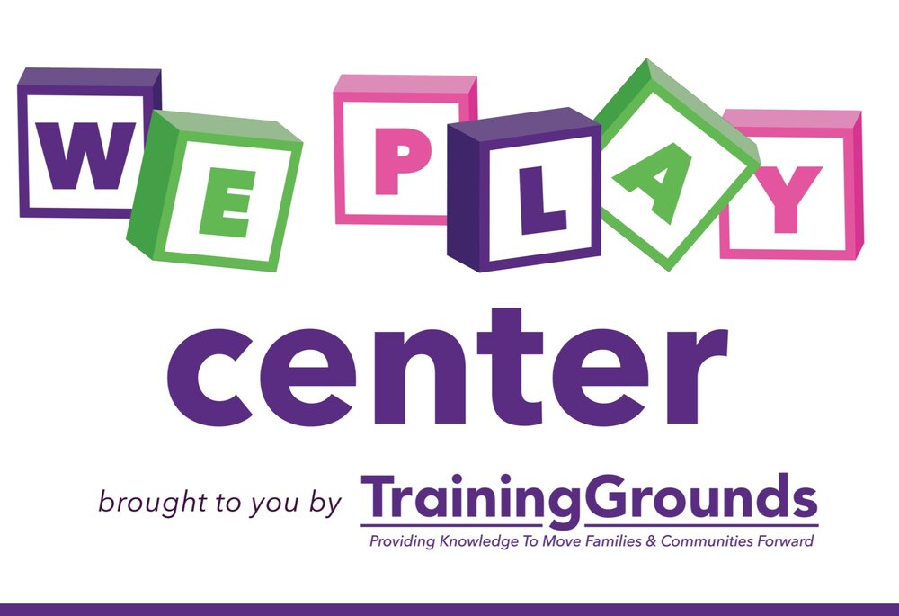

# WePLAY Center by Training Grounds NOLA Survey Data

### https://renarepenning.github.io/weplaynoladata/

Intro to Data Science (CMPS3160) Final Project. 
Class taught by Dr Nicholas Mattei during Fall 2021 at Tulane University.
Created by Rena Repenning and Eddy Salazar.
